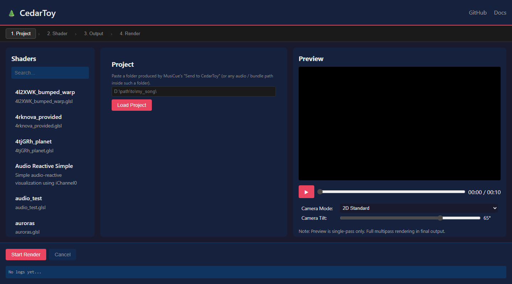
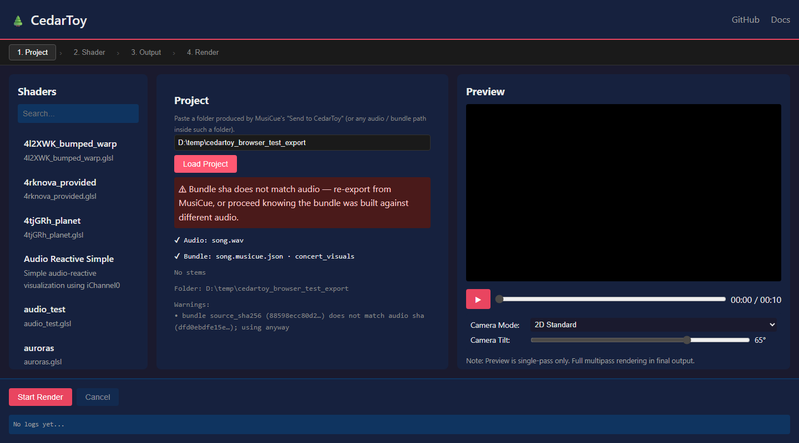
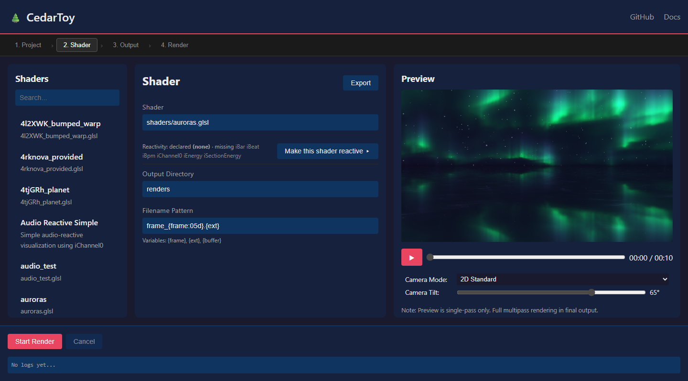
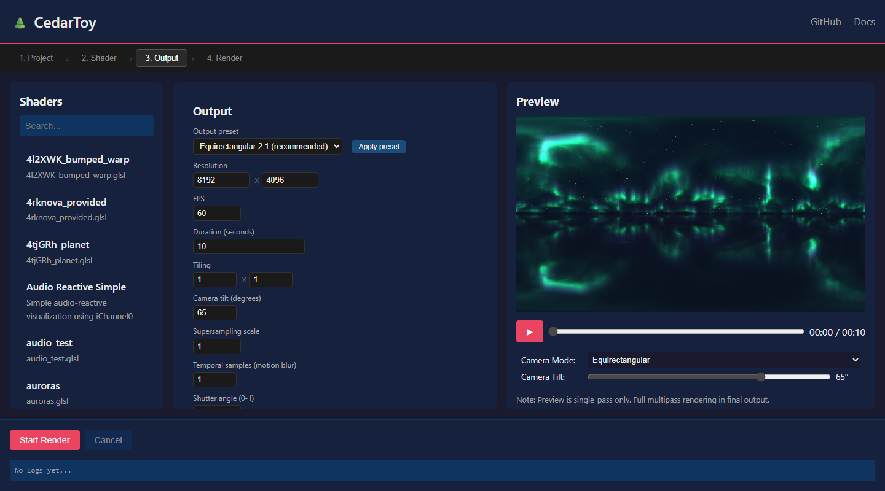
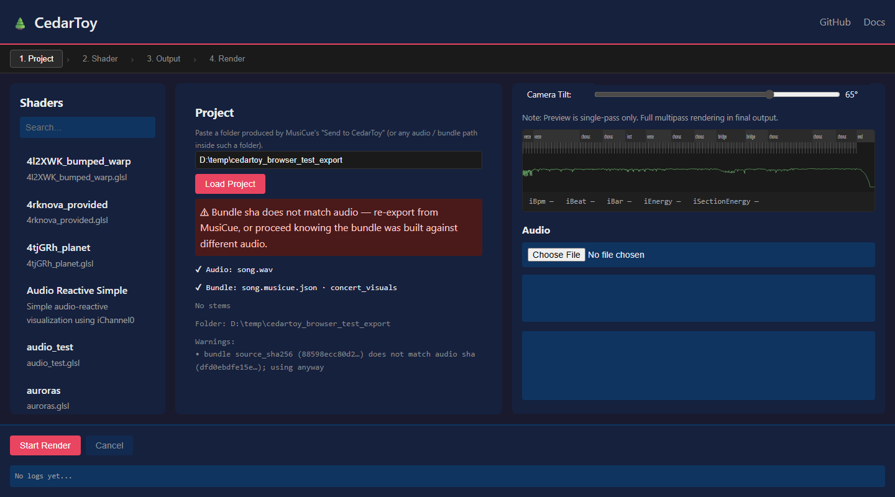
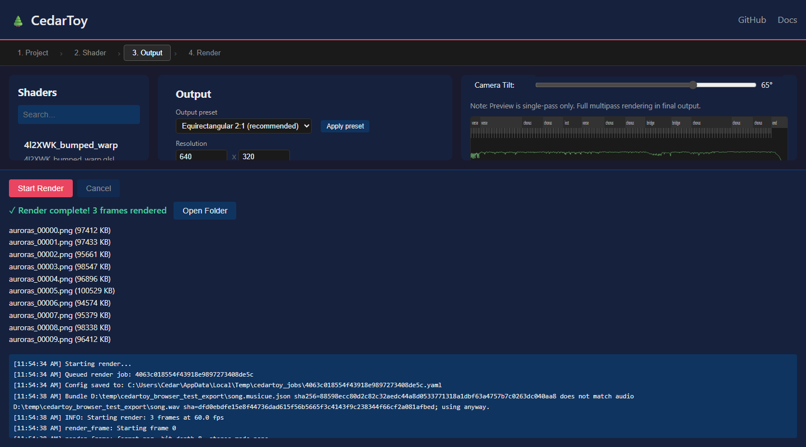

# CedarToy

> **Status:** v0.4 — Send-to-CedarToy folder workflow, stage-rail UI, cue scrubber, and reactivity prompt landed.

**CedarToy** is a headless, high-quality GLSL shader renderer designed for generative art, video production, and VR/dome content. It is compatible with Shadertoy shader syntax and extends it with high-resolution tiling, temporal supersampling, spherical camera mappings, and music-aware reactivity driven by [MusiCue](https://github.com/cedarconnor/MusiCue) bundles.

The Web UI is a four-stage workflow optimized around the core deliverable: a long, high-resolution spherical render driven by a structured song bundle.

---

## Quick start

```bash
git clone https://github.com/cedarconnor/cedartoy.git
cd cedartoy
pip install -r requirements.txt
python -m cedartoy.cli ui
```

Open <http://localhost:8080>. The UI opens on **Stage 1 — Project**.

---

## The workflow

The UI is a four-stage rail across the top: **1. Project → 2. Shader → 3. Output → 4. Render**. Each stage owns a focused panel; the shader browser (left) and preview (right) are persistent.

### Stage 1 — Project

Drop in a project folder produced by MusiCue's "Send to CedarToy" (or paste any audio / bundle / stem path inside such a folder). CedarToy resolves the folder, validates the bundle's `source_sha256` against the audio file, and surfaces what it found.



A project folder follows this layout (see [§ MusiCue integration](#musicue-integration) below):

```
my_song/
  song.wav                 audio
  song.musicue.json        bundle CedarToy reads
  manifest.json            grammar + MusiCue version + original filename
  stems/                   optional — for hand-mixing or future per-stem uniforms
    drums.wav  bass.wav  vocals.wav  other.wav
```

After loading, the panel shows the resolved audio file, the bundle's grammar, available stems, the resolved folder, and any warnings (e.g. sha mismatch when the bundle was built against a different decode of the same source).



The audio and bundle paths are propagated into the render config automatically — you don't need to type them again.

### Stage 2 — Shader

Pick a shader from the left rail (or type a path). CedarToy parses the shader source for known MusiCue-aware uniforms and shows you which ones are **declared** (i.e. the shader will react to that signal) and which ones are **missing** (the shader doesn't use that signal yet).



`Make this shader reactive ▸` copies a Claude-ready markdown prompt to your clipboard. The prompt embeds the current shader source plus the full reactivity cookbook (`docs/reactivity/REACTIVITY_COOKBOOK.md`) and instructs the LLM to retrofit the shader using documented idioms (`kick_pulse_camera`, `beat_pump_zoom`, `section_palette_shift`, `energy_brightness_lift`, etc.) while preserving the original look. Paste the prompt into Claude, take the GLSL it returns, and drop it back into the shader file.

### Stage 3 — Output

Spherical-first output presets, sized for the kind of render CedarToy exists to produce. The estimate at the bottom is a live computation driven by `~/.cedartoy/render_history.json` — once you've done one real render of a shader at a given resolution, every subsequent estimate sharpens.



| Output preset | Geometry | Typical use |
|---|---|---|
| **Equirectangular 2:1** (recommended) | 360° × 180° sphere unwrapped to a 2:1 rectangle | VR, immersive video, projection mapping |
| **LL180 dome** | 180° fisheye for hemispherical projection | Planetariums, dome shows |
| **Flat 16:9** | Standard perspective | Preview / testing / non-immersive output |

Tiling, supersampling, temporal samples (motion blur), shutter, format, and bit depth all live here. Renders that exceed 1 hour or 50 GB trigger a confirm modal at stage 4 before they start.

### Cue scrubber + live uniform readout

Below the preview, the cue scrubber renders the bundle's structural data over the song's duration:

- **Section blocks** (intro / verse / chorus / bridge / outro)
- **Bar and beat ticks** (downbeats taller than off-beats)
- **Kick onsets** (dots on the lower half)
- **Global energy curve** (green polyline)



The read-out below the SVG shows the bundle uniforms at the current preview time (`iBpm`, `iBeat`, `iBar`, `iEnergy`, `iSectionEnergy`) — so you can confirm "the shader brightens on the drop" *before* committing to a multi-hour render. Click anywhere on the timeline to jump the preview playhead there.

### Stage 4 — Render

Hit **Start Render** in the footer. Progress streams over WebSocket. Completed renders list every emitted frame and offer an Open Folder button. The render history file is updated on success so the next estimate has real data instead of the 5 s/frame default.



The log line in the footer confirms which bundle was loaded (and whether the sha matched the audio).

---

## MusiCue integration

CedarToy can drive a shader from raw FFT amplitude alone, but if you also use [**MusiCue**](https://github.com/cedarconnor/MusiCue), you get structured musical events instead — beats, drum hits, section transitions, MIDI activity — packaged as a single JSON file that ships next to your audio.

### Recommended: portable project folder

In MusiCue, open a song in the Editor and click **→ Send to CedarToy**. Pick an output folder (defaults to `exports/<song>/`), choose a grammar (default `concert_visuals`), tick **Include stems** if you want them, and click **Export ▶**. MusiCue writes the folder layout shown in [§ Stage 1](#stage-1--project) above.

On the CedarToy machine, point Stage 1 at that folder. Done.

### Headless equivalents

```bash
# Portable folder layout (matches the MusiCue web-UI button):
musicue send-to-cedartoy my_music.mp3 --output exports/my_music

# Or use export-bundle directly:
musicue export-bundle my_music.mp3 --folder exports/my_music --include-stems

# Legacy single-file form — still supported for one-off renders:
musicue export-bundle my_music.mp3
```

The legacy single-file form writes `my_music.musicue.json` next to the audio; CedarToy still auto-discovers it sibling-style when you point at the audio. Use the folder form when you'll be moving the result between machines.

### Bundle-aware shader uniforms

CedarToy binds five new uniforms whenever a bundle is loaded. Declaring any of them in your GLSL opts the shader into bundle-aware reactivity:

```glsl
uniform float iBpm;            // current BPM
uniform float iBeat;           // [0,1] phase within the current beat
uniform int   iBar;            // 0-indexed bar number
uniform float iSectionEnergy;  // [0,1] energy rank of current section
uniform float iEnergy;         // [0,1] global energy at this moment
```

Shaders that don't declare these still work — they see the bundle-driven `iChannel0` texture and behave more musically without any code change.

### Bundle mode

Switch behavior with `--bundle-mode` (or the equivalent dropdown):

| Mode | Behavior |
|---|---|
| `auto` (default) | Use the bundle if one exists, otherwise fall back to raw audio |
| `raw` | Ignore the bundle, use raw FFT amplitude |
| `cued` | Use the bundle's synthesized `iChannel0` texture |
| `blend` | Mix raw + cued by `--bundle-blend 0..1` |

See [docs/AUDIO_SYSTEM.md](docs/AUDIO_SYSTEM.md) for the technical reference (bin mappings, ADSR envelopes, history texture layout).

---

## Authoring shader reactivity with Claude

CedarToy ships two reactivity authoring assets under [`docs/reactivity/`](docs/reactivity/):

1. **`MUSICUE_REACTIVITY_PROMPT.md`** — paste-able Claude prompt template.
2. **`REACTIVITY_COOKBOOK.md`** — versioned cookbook of GLSL idioms (`kick_pulse_camera`, `beat_pump_zoom`, `section_palette_shift`, `energy_brightness_lift`, `bar_anchored_strobe`, `melodic_glow_tint`, `hat_grain`).

The fast path: in Stage 2, click **Make this shader reactive ▸**. The button reads the current shader, fills the prompt with its source and the full cookbook, and copies the result (an ~11.8 KB markdown blob) to your clipboard. Paste into [Claude](https://claude.ai), and Claude returns a modified shader in a single fenced GLSL block — drop it back into the shader file.

Each cookbook entry documents which inputs it reads, what it modulates, a default amplitude, and a recommended cap so the original visual identity stays recognizable even when the song is silent.

---

## CLI

```bash
# Web UI (default port 8080)
python -m cedartoy.cli ui

# Headless render
python -m cedartoy.cli render shaders/luminescence.glsl \
  --output-dir renders/test \
  --width 1920 --height 1080 --duration-sec 5

# Audio-reactive render (auto-discovers <stem>.musicue.json sibling)
python -m cedartoy.cli render shaders/luminescence.glsl \
  --audio-path my_song/song.wav \
  --fps 30

# Equirectangular sphere render with bundle
python -m cedartoy.cli render shaders/auroras.glsl \
  --camera-mode equirect --width 8192 --height 4096 \
  --audio-path my_song/song.wav --bundle-mode cued
```

### Generic shader parameters

Expose custom uniforms to the UI by adding `@param` comments to your GLSL:

```glsl
// @param audio_strength float 2.0 0.0 5.0 "Audio Strength"
// @param pulse_speed    float 2.0 0.0 10.0 "Pulse Speed"

uniform float audio_strength;
uniform float pulse_speed;
```

CedarToy parses these and renders sliders in the Web UI under the shader-parameters section.

---

## Documentation

- [User Guide](docs/USER_GUIDE.md) — CLI options, camera modes, configuration reference.
- [Audio System](docs/AUDIO_SYSTEM.md) — FFT layout, history texture, MusiCue bundle integration.
- [Developer Guide](docs/DEVELOPER.md) — Architecture notes, render-job lifecycle, reliability extension points.
- [Reactivity Prompt](docs/reactivity/MUSICUE_REACTIVITY_PROMPT.md) — Claude template.
- [Reactivity Cookbook](docs/reactivity/REACTIVITY_COOKBOOK.md) — GLSL idiom library.

---

## Capturing the README screenshots

The screenshots above are reproducible. With the CedarToy UI running on `http://127.0.0.1:8080` and a project folder at `D:/temp/cedartoy_browser_test_export`:

```bash
pip install playwright && playwright install chromium
python scripts/capture_readme_screenshots.py
```

Outputs land in `docs/screenshots/0[1-6]_*.png`.
