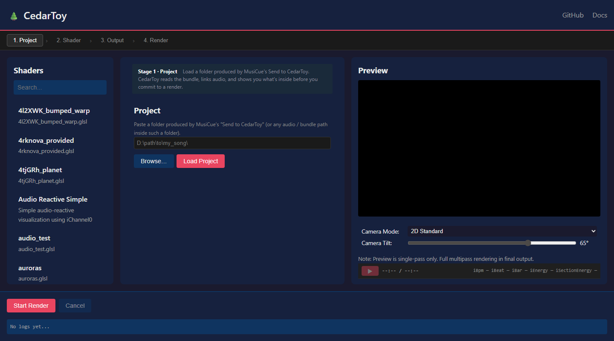
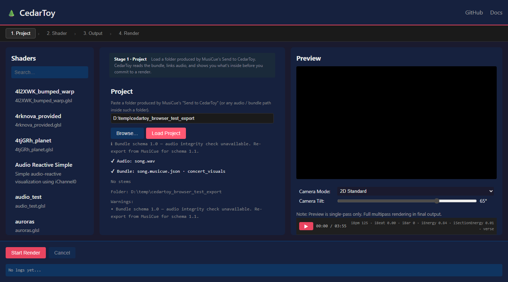
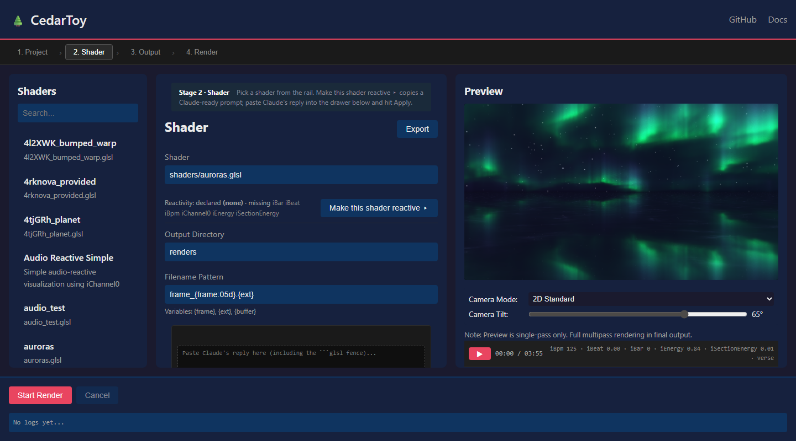
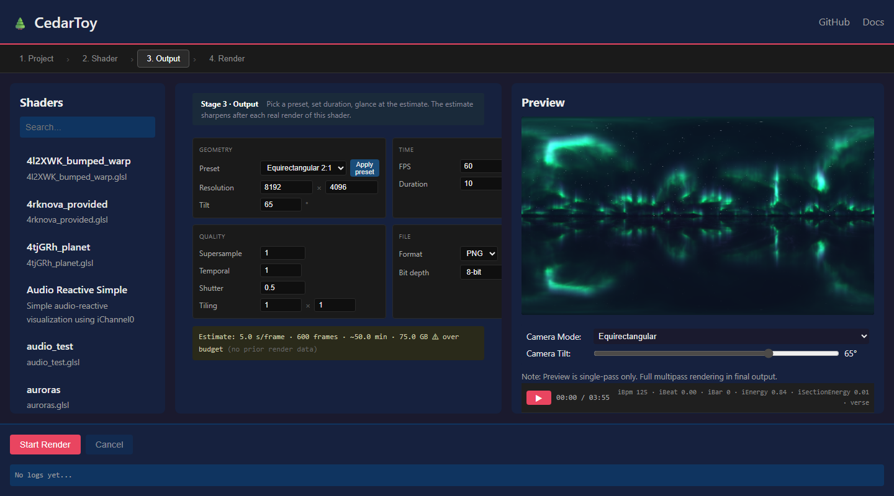
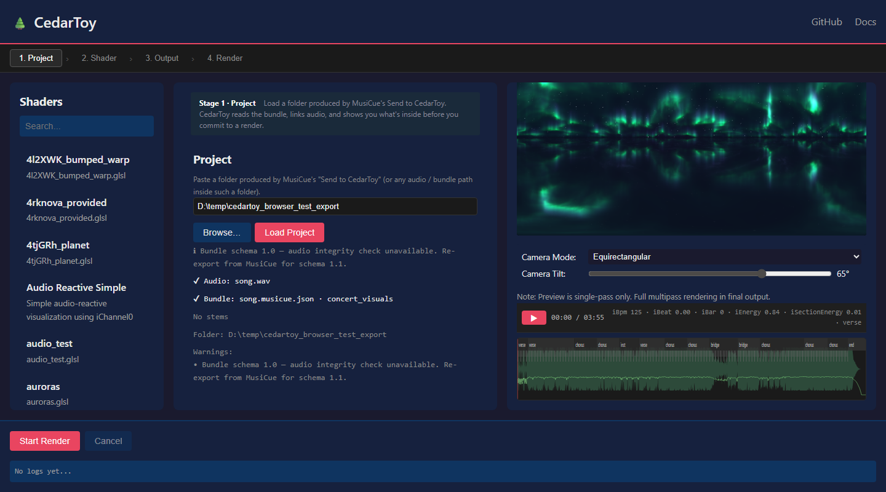
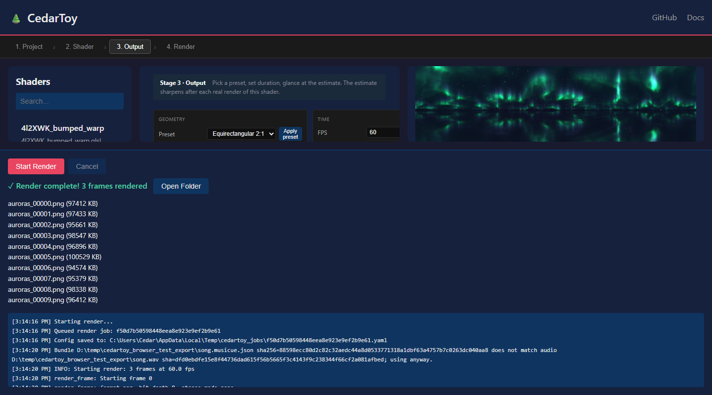

# CedarToy

> **Status:** v0.6 — **Validate mode**: a near-full-screen preview with a per-track timeline, per-track **mute / solo**, **calibration** (gain / threshold / smoothing), a playhead **cue inspector**, **section loop**, and a four-panel **A/B grid** (raw / cued / blend / no-audio). The preview is now driven by the same bundle signal the render uses (**preview ⇄ render parity**), mutes/calibration persist into the final render, the Make-Reactive prompt now embeds the loaded song's available bundle data, and shader source is served/fetched `no-store` so "Apply over original" always recompiles fresh.
>
> **v0.5** — Unified preview-sync (audio + shader + cue scrubber in one playhead), paste-back Claude round-trip with compile-error fix-it loop, native folder picker, 2×2 output grid, per-stage helper bars, bundle schema 1.1 (no more false-positive sha warning).

**CedarToy** is a headless, high-quality GLSL shader renderer for generative art, video production, and VR/dome content. It is compatible with Shadertoy shader syntax and extends it with high-resolution tiling, temporal supersampling, spherical camera mappings, and music-aware reactivity driven by [MusiCue](https://github.com/cedarconnor/MusiCue) bundles.

The Web UI is a four-stage workflow optimized around the core deliverable: a long, high-resolution spherical render driven by a structured song bundle.

---

## Quick start

```bash
git clone https://github.com/cedarconnor/cedartoy.git
cd cedartoy
pip install -r requirements.txt
python -m cedartoy.cli ui
```

Open <http://localhost:8080>. The UI opens on **Stage 1 — Project**.

---

## The workflow

The UI is a four-stage rail across the top: **1. Project → 2. Shader → 3. Output → 4. Render**. Each stage opens with a compact helper bar (bold title + a one-line "what to do here"), and the shader browser (left) plus preview (right) are persistent.

### Stage 1 — Project

Click **Browse…** for a native OS folder picker, or paste a path into the input. Once loaded, CedarToy validates the bundle against the audio file and shows what it found.



A project folder follows this layout (see [§ MusiCue integration](#musicue-integration) below):

```
my_song/
  song.wav                 audio
  song.musicue.json        bundle CedarToy reads (schema 1.1)
  manifest.json            grammar + MusiCue version + original filename
  stems/                   optional — for hand-mixing or future per-stem uniforms
    drums.wav  bass.wav  vocals.wav  other.wav
```

After loading, the panel shows audio, bundle grammar, stems, the resolved folder, and any warnings. Bundle schema 1.1 carries a `decoded_audio_sha256` so the integrity check fires **only on real corruption** — older 1.0 bundles get a one-line "integrity check unavailable; re-export for 1.1" note instead of a false-positive warning.



The audio and bundle paths flow directly into the render config — you don't type them again. The transport strip arms itself with `<audio src="/api/project/audio?path=…">` so the play button is ready to use.

### Stage 2 — Shader

Pick a shader from the left rail. CedarToy parses its source for known MusiCue-aware uniforms and shows which are **declared** vs. **missing**.



**Make this shader reactive ▸** copies a Claude-ready markdown prompt to your clipboard (embeds the current shader source + the full reactivity cookbook). Paste it into [Claude](https://claude.ai), take the GLSL it returns, and paste the **entire reply** into the drawer at the bottom of Stage 2.

Hit **Apply**. CedarToy:

1. Extracts the first ` ```glsl ` fenced block from your paste (or accepts raw GLSL).
2. Atomically writes it to `shaders/<name>_reactive.glsl` (the original stays untouched).
3. Switches the preview to the new shader and recompiles.

If WebGL refuses the GLSL, the drawer flips to an error state, shows the verbatim `gl.getShaderInfoLog()` log, and surfaces a **📋 Copy fix-it prompt ▸** button. The fix-it prompt bundles the original shader, the broken attempt, the compile error, and the full cookbook so Claude has everything it needs to repair the bug. Paste the fix back into the drawer, hit Apply again, loop until clean. **Apply over original** (with a confirm) replaces the source file when you're happy.

### Stage 3 — Output

Spherical-first presets, sized for the kind of render CedarToy exists to produce. The output panel is a **2×2 grid grouped by concern** — Geometry, Time, Quality, File — with every input tooltipped so you can hover any field for a "what does this do" hint. The render estimate is pinned at the bottom and sharpens after each real render of the same shader at the same resolution.



| Output preset | Geometry | Typical use |
|---|---|---|
| **Equirectangular 2:1** (recommended) | 360° × 180° sphere unwrapped to a 2:1 rectangle | VR, immersive video, projection mapping |
| **LL180 dome** | 180° fisheye for hemispherical projection | Planetariums, dome shows |
| **Flat 16:9** | Standard perspective | Preview / testing / non-immersive output |

Renders that exceed 1 hour or 50 GB trigger a confirm modal at Stage 4 before they start.

### Unified transport + cue scrubber

Below the preview canvas, the **transport strip** owns playback for everything in the page:

- One ▶ button drives audio + shader + cue scrubber.
- One time display (`mm:ss / mm:ss`).
- One readout of the bundle's current uniforms: `iBpm  ·  iBeat  ·  iBar  ·  iEnergy  ·  iSectionEnergy  ·  <section label>`.
- Keyboard: **Space** toggles play, **←/→** seeks ±1 s, **`[`/`]`** jumps to previous / next section.

The **cue scrubber** beneath it renders the bundle's structural data over the song's duration, with audio waveform painted as an underlay:

- **Waveform peaks** (the dim green fill across the rail)
- **Section blocks** (intro / verse / chorus / bridge / outro)
- **Bar and beat ticks** (downbeats taller)
- **Kick onsets** (red dots on the lower half)
- **Global energy curve** (green polyline)
- **Playhead** (red vertical line) — same line that's driven by the transport strip



Click anywhere on the scrubber to seek; audio + shader + playhead jump together. The transport's `transport-frame` event is the single source of truth for time — preview-panel, cue-scrubber, and the readout all subscribe to it.

### Stage 4 — Render

Hit **Start Render** in the footer. Progress streams over WebSocket. Completed renders list every emitted frame and offer an Open Folder button. The render history file (`~/.cedartoy/render_history.json`) is updated on success so the next estimate has real data instead of the 5 s/frame default.



The log line in the footer confirms which bundle was loaded.

---

## Validate mode — see and verify what the music drives

A **Validate** toggle in the header flips CedarToy into a near-full-screen preview built for one question: *which musical track is driving which visual change?* It is the fastest way to confirm a shader reacts the way you intended **before** committing to a long render.

**Preview ⇄ render parity.** In Validate mode the preview is driven by the **same bundle-synthesized signal the headless render uses** — not the browser's live FFT — so what you see is what the final render produces. (Outside Validate mode the preview still uses live FFT for a quick look.) Under the hood, Python is the single canonical evaluator: it ships a per-track timeline the browser only *sums*, so the two paths can't drift (pinned by a parity test).

**Per-track mute / solo.** A multi-lane track graph docks under the preview — one lane per source track:

- drums — `kick`, `snare`, `hat`, `tom`, `cymbal`, `other`
- melodic stems — `vocals`, `other`, `bass`
- `tempo`, `sections`, `energy`

Each lane has **M**(ute) and **S**(olo) buttons and draws its data in its native shape (drum onsets as strength-sized ticks, stems/energy as sparklines, sections as labeled blocks, beats as ticks; empty tracks are flagged "no data"). Mute a track to confirm its contribution; solo one to isolate it. **Mutes persist into the final render** (saved as `track_settings`); solo is preview-only.

**Calibration.** Each lane also exposes **gain / threshold / smoothing** sliders. Gain boosts a weak track so you can see it, threshold gates noise, and smoothing applies a causal one-pole low-pass to soften a track's response. The math runs identically in the preview and the render, so a dialed-in calibration ships with the render.

**Cue inspector.** A live readout at the playhead shows the current section, bar/beat, the six bundle uniforms actually being sent, and each track's effective (post-mute/calibration) value — so "is it driving?" is never a guess.

**Section loop.** **🔁 Loop section** repeats the section under the playhead, so you can dial in a chorus or drop without scrubbing.

**A/B comparison grid.** The **A/B** toggle splits the preview into four synchronized panels — **raw FFT**, **cued** (bundle), **blend**, and **no-audio** — same shader, same playhead — so you can see at a glance whether the MusiCue data is helping or hiding the music.

---

## MusiCue integration

CedarToy can drive a shader from raw FFT amplitude alone, but if you also use [**MusiCue**](https://github.com/cedarconnor/MusiCue), you get structured musical events — beats, drum hits, section transitions, MIDI activity — packaged next to your audio.

### Recommended: portable project folder

In MusiCue, open a song in the Editor and click **→ Send to CedarToy**. Pick an output folder (defaults to `exports/<song>/`), choose a grammar (default `concert_visuals`), tick **Include stems** if you want them, and click **Export ▶**. MusiCue writes the folder layout shown in [§ Stage 1](#stage-1--project) above.

On the CedarToy machine, hit **Browse…** in Stage 1 and pick the exported folder. Done.

### Bundle schema 1.1

The bundle JSON (`song.musicue.json`) carries both:

- `source_sha256` — sha of the original m4a/mp3 (traceability back to the user's source).
- `decoded_audio_sha256` — sha of the WAV CedarToy actually reads (real integrity check).

CedarToy compares the loaded audio's sha against `decoded_audio_sha256`. The warning fires *only* on real corruption or replacement. Schema 1.0 bundles (no `decoded_audio_sha256`) read with a benign info note instead.

### Headless equivalents

```bash
# Portable folder layout (matches the MusiCue web-UI button):
musicue send-to-cedartoy my_music.mp3 --output exports/my_music

# Or use export-bundle directly:
musicue export-bundle my_music.mp3 --folder exports/my_music --include-stems

# Legacy single-file form — still supported for one-off renders:
musicue export-bundle my_music.mp3
```

### Bundle-aware shader uniforms

CedarToy binds six uniforms whenever a bundle is loaded. Declaring any of them in your GLSL opts the shader into bundle-aware reactivity:

```glsl
uniform float iBpm;            // current BPM
uniform float iBeat;           // [0,1] phase within the current beat
uniform int   iBar;            // 0-indexed bar number
uniform float iSectionEnergy;  // [0,1] energy rank of current section
uniform int   iSectionId;      // stable per-label section id (verse=0, chorus=1, …)
uniform float iEnergy;         // [0,1] global energy at this moment
```

These six uniforms — plus the bundle-synthesized `iChannel0` texture — are exactly what Validate mode lets you mute, solo, and calibrate per track.

Shaders that don't declare these still work — they see the bundle-driven `iChannel0` texture and behave more musically without any code change.

### Bundle mode

Switch behavior with `--bundle-mode` (or the equivalent dropdown):

| Mode | Behavior |
|---|---|
| `auto` (default) | Use the bundle if one exists, otherwise fall back to raw audio |
| `raw` | Ignore the bundle, use raw FFT amplitude |
| `cued` | Use the bundle's synthesized `iChannel0` texture |
| `blend` | Mix raw + cued by `--bundle-blend 0..1` |

See [docs/AUDIO_SYSTEM.md](docs/AUDIO_SYSTEM.md) for the technical reference (bin mappings, ADSR envelopes, history texture layout).

---

## Authoring shader reactivity with Claude

CedarToy ships two reactivity authoring assets under [`docs/reactivity/`](docs/reactivity/):

1. **`MUSICUE_REACTIVITY_PROMPT.md`** — paste-able Claude prompt template.
2. **`REACTIVITY_COOKBOOK.md`** — versioned cookbook of GLSL idioms (`kick_pulse_camera`, `beat_pump_zoom`, `section_palette_shift`, `energy_brightness_lift`, `bar_anchored_strobe`, `melodic_glow_tint`, `hat_grain`).

The fast path:

1. **Stage 2** → click **Make this shader reactive ▸** — copies an ~11 KB markdown prompt to your clipboard.
2. Paste into [Claude](https://claude.ai). Claude returns a modified shader in a fenced GLSL block.
3. Paste Claude's whole reply into the drawer at the bottom of Stage 2 → hit **Apply** → preview now runs `<shader>_reactive.glsl`.
4. If it doesn't compile, hit **📋 Copy fix-it prompt ▸** in the drawer's error state. The fix-it prompt bundles the original shader, the broken attempt, the GL error, and the cookbook. Paste it into Claude, take the fix, paste back into the drawer, Apply. Repeat until clean.

Each cookbook entry documents which inputs it reads, what it modulates, a default amplitude, and a recommended cap so the original visual identity stays recognizable even when the song is silent.

When a project is loaded, the **Make this shader reactive ▸** prompt also embeds a summary of *that song's* available bundle data — which drums, stems, and sections are actually populated — so Claude maps reactivity only to tracks that exist rather than guessing. And because shader source is now served and fetched `no-store`, **Apply over original** always recompiles the freshly written file (no stale-cache surprises).

---

## CLI

```bash
# Web UI (default port 8080)
python -m cedartoy.cli ui

# Headless render
python -m cedartoy.cli render shaders/luminescence.glsl \
  --output-dir renders/test \
  --width 1920 --height 1080 --duration-sec 5

# Audio-reactive render (auto-discovers <stem>.musicue.json sibling)
python -m cedartoy.cli render shaders/luminescence.glsl \
  --audio-path my_song/song.wav \
  --fps 30

# Equirectangular sphere render with bundle
python -m cedartoy.cli render shaders/auroras.glsl \
  --camera-mode equirect --width 8192 --height 4096 \
  --audio-path my_song/song.wav --bundle-mode cued
```

### Generic shader parameters

Expose custom uniforms to the UI by adding `@param` comments to your GLSL:

```glsl
// @param audio_strength float 2.0 0.0 5.0 "Audio Strength"
// @param pulse_speed    float 2.0 0.0 10.0 "Pulse Speed"

uniform float audio_strength;
uniform float pulse_speed;
```

CedarToy parses these and renders sliders in the Web UI under the shader-parameters section.

---

## Documentation

- [User Guide](docs/USER_GUIDE.md) — CLI options, camera modes, configuration reference.
- [Audio System](docs/AUDIO_SYSTEM.md) — FFT layout, history texture, MusiCue bundle integration.
- [Developer Guide](docs/DEVELOPER.md) — Architecture notes, render-job lifecycle, reliability extension points.
- [Reactivity Prompt](docs/reactivity/MUSICUE_REACTIVITY_PROMPT.md) — Claude template.
- [Reactivity Cookbook](docs/reactivity/REACTIVITY_COOKBOOK.md) — GLSL idiom library.
- [UX & Sync Pass spec (v0.5)](docs/superpowers/specs/2026-05-16-cedartoy-ux-sync-pass.md) — design doc for the five plans (A–E) that shipped v0.5.

---

## Capturing the README screenshots

The screenshots above are reproducible. With the CedarToy UI running on `http://127.0.0.1:8080` and a project folder at `D:/temp/cedartoy_browser_test_export`:

```bash
pip install playwright && playwright install chromium
python scripts/capture_readme_screenshots.py
```

Outputs land in `docs/screenshots/0[1-6]_*.png`.
